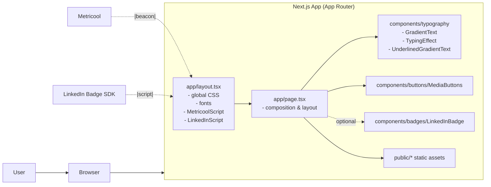
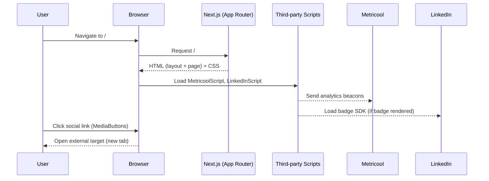

# Software Engineer Zaidibeth Ramos - Portfolio

#Project Description
This project is a modern, accessible portfolio website built with Next.js, TypeScript, and Tailwind CSS.

## 🚀 Features

- **Modern Design**: Clean, responsive layout with gradient text effects
- **Accessibility**: WCAG compliant with proper ARIA labels and semantic HTML
- **Performance**: Optimized with Next.js 15 and Turbopack
- **TypeScript**: Full type safety throughout the application
- **Error Handling**: Graceful error boundaries and loading states
- **SEO Optimized**: Proper meta tags and structured data

## 🛠️ Tech Stack

### Frontend

- **Framework**: Next.js 15 with App Router
- **Language**: TypeScript
- **Styling**: Tailwind CSS
- **Icons**: Material-UI Icons
- **Fonts**: Geist Sans & Roboto
- **Analytics**: Metricool integration

### Backend

   - **Python**: primary language for services and tooling
   - **FastAPI**: async REST APIs
   - **Supabase and PostgreSQL**:  managed database, auth, and storage
   - **Docker**: reproducible local/dev/prod environments

## Architecture

### Module map


### Request/interaction flow



## 📁 Project Structure

```
portfolio/
├── app/                    # Next.js app directory
│   ├── layout.tsx         # Root layout with metadata
│   ├── page.tsx           # Main portfolio page
│   └── globals.css        # Global styles
├── components/            # Reusable components
│   ├── badges/           # Badge components
│   ├── buttons/          # Button components
│   ├── scripts/          # Third-party script components
│   └── typography/       # Text and animation components
├── providers/            # Context providers
└── public/              # Static assets
```

## 🎨 Components

### Core Components
- **GradientText**: Animated gradient text with accessibility support
- **CyclingTypingEffect**: Dynamic typing animation for professional roles
- **MediaButtons**: Social media and contact links with hover effects
- **LinkedInBadge**: LinkedIn profile integration
- **ErrorBoundary**: Graceful error handling
- **LoadingSpinner**: Loading state component

## 🚀 Getting Started

1. **Clone the repository**
   ```bash
   git clone https://github.com/zergcore/portfolio.git
   cd portfolio
   ```

2. **Install dependencies**
   ```bash
   npm install
   ```

3. **Run the development server**
   ```bash
   npm run dev
   ```

4. **Open your browser**
   Navigate to [http://localhost:3000](http://localhost:3000)

## 🎯 Key Features

- **Responsive Design**: Works seamlessly on all device sizes
- **Fast Loading**: Optimized for performance with Next.js 15
- **SEO Ready**: Proper meta tags and structured data
- **Accessible**: WCAG 2.1 AA compliant
- **Modern**: Built with the latest web technologies

## 📊 Analytics

The portfolio includes integration with:
- **Metricool**: For analytics and performance tracking
- **LinkedIn**: For professional networking integration

## 🤝 Contributing

This is a personal portfolio project, but suggestions and feedback are welcome!

## 📄 License

This project is private and proprietary.

---

**Built with ❤️ by Zaidibeth Ramos**
